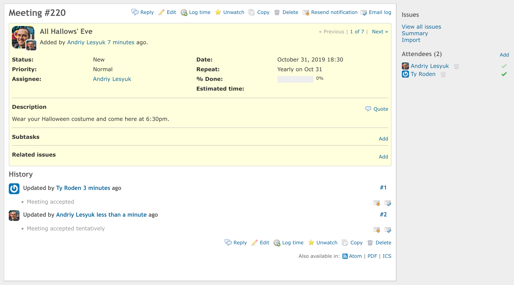
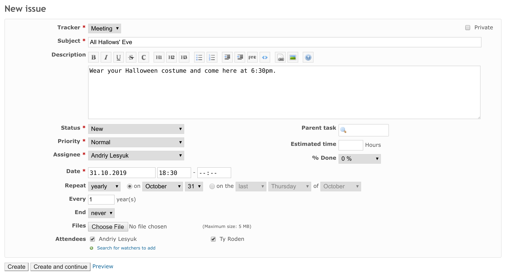

# That Meeting Plugin for Redmine

This plugin allows Redmine issues to act as [iCalendar](https://icalendar.org/)
events (i.e., implements [iTIP](https://tools.ietf.org/html/rfc5546) and
[iMIP](https://tools.ietf.org/html/rfc6047) support for Redmine). Create issues
using the event tracker, that you define, and Redmine will send out calendar
meetings / events as you would with any calendar software. Events no longer
need to be created outside of Redmine and all communication related to
the events stays within Redmine for ease of reference. Due to the nature of the
iCalendar protocols this functionality relies on Redmine's email integration
([notifications](http://www.redmine.org/projects/redmine/wiki/EmailConfiguration) and
[receiving](https://www.redmine.org/projects/redmine/wiki/RedmineReceivingEmails)),
which, therefore, must be configured for the plugin to work.

When the plugin is enabled (for the issue tracker), an issue creation email
notification becomes an event invitation. Then, when email clients, that support
iCalendar (such as Google Mail, Thunderbird, Outlook), receive the email, they will render it
as an event allowing recipients to add the event to their calendar and respond to the
invitation (accept - tentatively, if not sure - or decline). The response is
then sent back to Redmine and handled by the plugin (if Redmine's
[email receiving](https://www.redmine.org/projects/redmine/wiki/RedmineReceivingEmails)
is properly configured). In this way, user responses are added to the issue
history and shown on the sidebar:

_As you can see on this screenshot, if the meeting functionality is enabled for
the issue tracker, the issue's watchers are treated as attendees._

When an issue acts as an iCalendar event, any modification to the issue related
to the event (e.g., change of the start date) sends the updated iCalendar
information to all attendees (watchers). In this way, all attendees will
automatically have the updated event in their calendars.

The plugin supports all of the basic scheduling and recurrence settings, that are
supported by major calendar software. These include:

- Start time and end time or duration (issue's estimated time)
- Daily, weekly, monthly and yearly recurrence types
- Month-day based (e.g., on October 31) or weekday based (e.g., on last
  Thursday) scheduling
- Interval (i.e., every Nth occurrence)
- Event can be repeated N times or until an end date

Additionally, the plugin comes with the following features:

- Events' **Start time**, **End time** and **Repeat** can be shown in the issues
  list (a.k.a., the issue query)
- Issues, for which the iCalendar functionality is enabled, can be exported in ICS

The following things are incomplete or may not work as expected:

- Currently, only the first occurrence of the event is shown in the Redmine calendar
- Some iCalendar clients (such as Google Calendar) allow to propose new time
  for events (so called `COUNTER` requests) - this is not currently supported by
  That Meeting plugin (when it receives such a request, it automatically sends
  `DECLINECOUNTER` in response)
- If issue start and due date attributes are configured to be set automatically
  depending on their values in subtasks (in **Administration** - **Settings** -
  **Issue tracking** - **Parent tasks attributes**), the issues, for which the
  meeting functionality is enabled, will be denied to have subtasks (otherwise,
  the meeting date would depend on them)

## Installation

- Move `that_meeting` directory to the `plugins` directory of Redmine
- Run `bundle install --without development test` (this will install `icalendar` and `rrule` gems)
- Run `rake redmine:plugins:migrate RAILS_ENV=production`
- Restart Redmine

## Configuration

- Make sure, that email delivery is configured in Redmine
  (see [here](http://www.redmine.org/projects/redmine/wiki/EmailConfiguration))
- Make sure, that _Issues added_ and _Issues updated_ actions are enabled in
  **Administration** - **Settings** - **Email notifications**.
- Configure email receiving to let Redmine receive iCal responses
  (see [here](https://www.redmine.org/projects/redmine/wiki/RedmineReceivingEmails))

In the plugin's settings:

- Choose the trackers, for which the meetings functionality should be enabled
  _(you may need to create a special tracker for meetings)_
- Choose the issue statuses, which will be used to cancel meetings
- Choose whether users' email visibility preferences should be respected
  (without this users' email addresses will be included into iCalendar files,
  even if they checked **Hide my email address** in their accounts)
- Choose whether email notifications with iCal attachments should be enforced
  for meetings (if users have chosen not to be notified of changes, that they
  made themselves, they won't get invitations for meetings, that they create,
  if this setting is not enabled)
- Choose whether Redmine should send email notifications about meeting replies
  (meeting replies are saved to issue history regardless of this option, but it
  can be used to reduce the amount of email notifications, when a meeting has
  too many attendees)
- Choose the time zone, which will be used for all meeting dates
- Choose the time zone format, which should be used in time values

This is automatically adjusted by the plugin, but it's worth having the Redmine
configuration consistent with the plugin's behavior (optional):

- Make sure **Assignee** and **Start date** attributes are enabled for meeting
  trackers
- Using **Workflow** - **Fields permissions** make **Assignee** and **Start date**
  attributes required for meeting trackers (for all roles)
- Using **Workflow** - **Fields permissions** make **Due date** attribute
  read-only for meeting trackers (for all roles) or just disable this attribute
  in **Trackers**

## License

GNU General Public License (GPL) v2.0

## Used Icons

- https://www.iconfinder.com/icons/14332/calendar_down_month_icon (Dat Nguyen)
- https://www.iconfinder.com/icons/1398911/check_correct_mark_success_tick_valid_yes_icon (iconpack)
- https://www.iconfinder.com/icons/1398919/cancel_close_cross_delete_incorrect_invalid_x_icon (iconpack)
